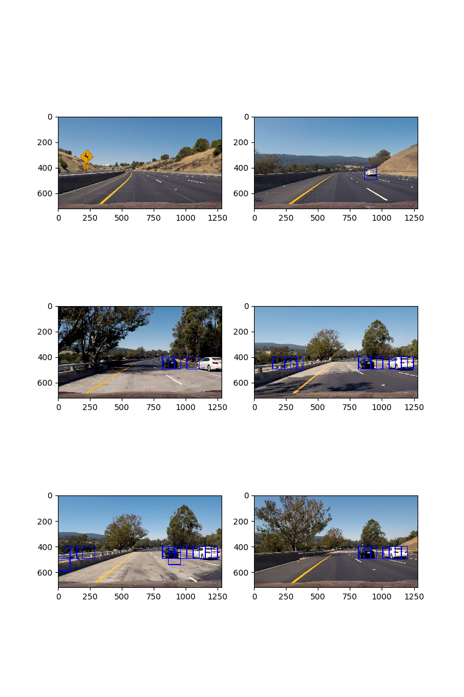
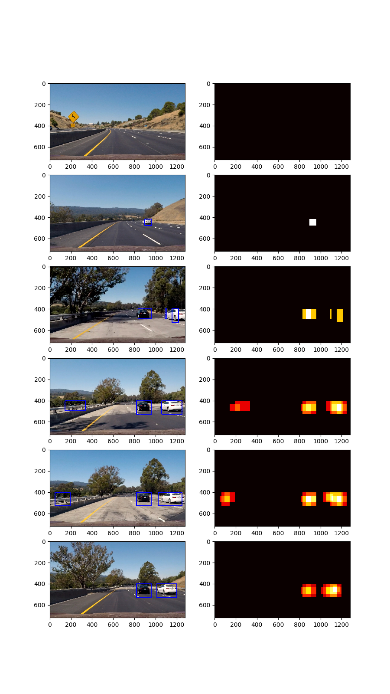
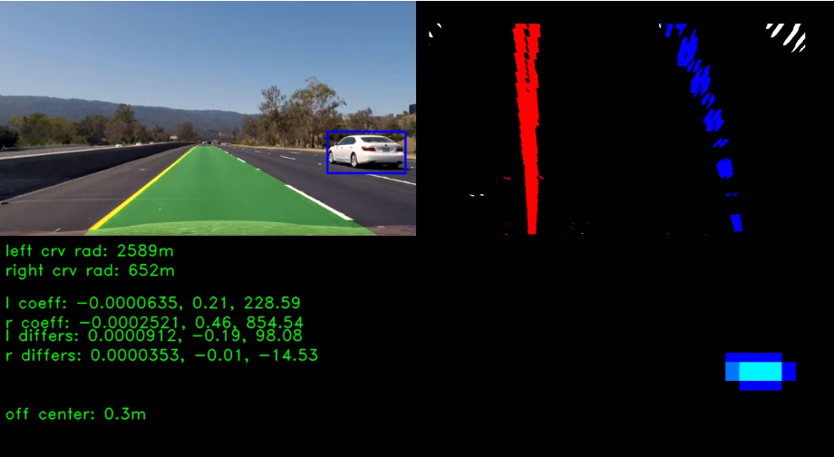

## Writeup Template
### You can use this file as a template for your writeup if you want to submit it as a markdown file, but feel free to use some other method and submit a pdf if you prefer.

---

**Vehicle Detection Project**

The goals / steps of this project are the following:

* Perform a Histogram of Oriented Gradients (HOG) feature extraction on a labeled training set of images and train a classifier Linear SVM classifier
* Optionally, you can also apply a color transform and append binned color features, as well as histograms of color, to your HOG feature vector.
* Note: for those first two steps don't forget to normalize your features and randomize a selection for training and testing.
* Implement a sliding-window technique and use your trained classifier to search for vehicles in images.
* Run your pipeline on a video stream (start with the test_video.mp4 and later implement on full project_video.mp4) and create a heat map of recurring detections frame by frame to reject outliers and follow detected vehicles.
* Estimate a bounding box for vehicles detected.

## [Rubric](https://review.udacity.com/#!/rubrics/513/view) Points
### Here I will consider the rubric points individually and describe how I addressed each point in my implementation.

---
### Writeup / README

## This project contain severial notebook files:
* 0_step_by_step.ipynb: the process code has been show step by step in this notebook. It contain the data reader class (which read the vehicle and non-vehicle dataset and extrat features from the images), the model function (which define a svm classifier) and training code. the model has been saved as 'svc.pickle' in the file system.
* 1_detect_vehicle_in_vedio.ipynb: Only detect the vehicle in the vedio
* 2_combine_lane_and_vehicle_detect.ipynb: detect the lane line and vehicle in the vedio
* feature_helper.py: some helper functions for extract features
* train_classifier.py: the develop python file for train a classifier, for develop and debug in IDE
* sliding_windows_search.py:  the develop python file for sliding window search, for develop and debug in IDE

#### 1. Provide a Writeup / README that includes all the rubric points and how you addressed each one.  You can submit your writeup as markdown or pdf.  [Here](https://github.com/udacity/CarND-Vehicle-Detection/blob/master/writeup_template.md) is a template writeup for this project you can use as a guide and a starting point.

You're reading it!

### Histogram of Oriented Gradients (HOG)

#### 1. Explain how (and identify where in your code) you extracted HOG features from the training images.
I defined a class called `DataReader()` to read the data and extract features. The `DataReader` is writed in the `0_step_by_step.ipynb` and `train_classifier.py`

I then explored different color spaces and different `skimage.hog()` parameters (`orientations`, `pixels_per_cell`, and `cells_per_block`).  I grabbed random images from each of the two classes and displayed them to get a feel for what the `skimage.hog()` output looks like.

I have done some experiments to determine which feature to extract, the result is shown in below:

```
only use hog feature:
the shape of the X_train are (14208, 1296)
number of test samples is 3552 1752.0 car samples and  1800.0 noncar samples
1.66 Seconds to train SVC...
Test Accuracy of SVC =  0.9868

hog + hist features
the shape of the X_train are (14208, 1488)
number of test samples is 3552 1741.0 car samples and  1811.0 noncar samples
31.69 Seconds to train SVC...
Test Accuracy of SVC =  0.9949

hog + hist + spal(32, 32) features:
the shape of the X_train are (14208, 4464)
number of test samples is 3552 1770.0 car samples and  1782.0 noncar samples
118.24 Seconds to train SVC...
Test Accuracy of SVC =  0.9961
But not perform well when searching windows !!!

```

so finally, I use only hog and hist features, the parameters are:

```
        color_space = 'YUV'  # Can be RGB, HSV, LUV, HLS, YUV, YCrCb
        orient = 12  # HOG orientations
        pix_per_cell = 16  # HOG pixels per cell
        cell_per_block = 2  # HOG cells per block
        hog_channel = "ALL"  # Can be 0, 1, 2, or "ALL"
        spatial_size = (32, 32)  # Spatial binning dimensions
        hist_bins = 64  # Number of histogram bins
        spatial_feat = False  # Spatial features on or off
        hist_feat = True  # Histogram features on or off
        hog_feat = True  # HOG features on or off
```


#### 2. Explain how you settled on your final choice of HOG parameters.

First I try the hog parameters like below:

```
orient = 8  # HOG orientations
pix_per_cell = 8  # HOG pixels per cell
cell_per_block = 2  # HOG cells per block
hog_channel = "ALL"  # Can be 0, 1, 2, or "ALL"
```

It is obvious that all channel can outperform a single channel. These parameters can perform well in the dataset. But I add more orientations and pix_per_cell after exteriments, so the finally HOG parameters is like:

```
orient = 12  # HOG orientations
pix_per_cell = 16  # HOG pixels per cell
cell_per_block = 2  # HOG cells per block
hog_channel = "ALL"  # Can be 0, 1, 2, or "ALL"
```

#### 3. Describe how (and identify where in your code) you trained a classifier using your selected HOG features (and color features if you used them).

I define a SVM model in the `model()` function, in both `0_step_by_step.ipynb` file and `train_classifier.py` file. I have not use the LinearSVC because it didn't work well when concat several kind of features.

I try to use the following code to search the best paramenter of svm:

```python
parameters = {'kernel': ('linear', 'rbf'), 'C': [1, 10]}
svc = svm.SVC()
clf = GridSearchCV(svc, parameters)
clf.fit(X_train, y_train)
```

finally I use the rbf as the kernel and C = 1.0, this model achieve the the Accuracy of **99.5\%** in test dataset.

### Sliding Window Search

#### 1. Describe how (and identify where in your code) you implemented a sliding window search.  How did you decide what scales to search and how much to overlap windows?

I use the `find_cars()` function in the lesson. When the car is far, the searching windows should be small, so I use small scales in the far place. If the car is near, the window should be larger, so I use large window in this situation. The final scale and y_start_stop is like :

```python
y_start_stop = [(400, 464), (416, 480), (400, 496), (432, 528), (400, 528), (432, 560), (400, 596), (464, 660)]
scale = [1.0, 1.0, 1.5, 1.5, 2.0, 2.0, 3.5, 3.5]
```


#### 2. Show some examples of test images to demonstrate how your pipeline is working.  What did you do to optimize the performance of your classifier?

Ultimately I searched on two scales using YUV 3-channel HOG features and histograms of color in the feature vector, which provided a nice result.  Here are some example images:


---

### Video Implementation

#### 1. Provide a link to your final video output.  Your pipeline should perform reasonably well on the entire project video (somewhat wobbly or unstable bounding boxes are ok as long as you are identifying the vehicles most of the time with minimal false positives.)
Here's a [link to my video result](./test_videos_output/project_video.mp4)


#### 2. Describe how (and identify where in your code) you implemented some kind of filter for false positives and some method for combining overlapping bounding boxes.

I recorded the positions of positive detections in each frame of the video.  From the positive detections I created a heatmap and then thresholded that map to identify vehicle positions.  I then used `scipy.ndimage.measurements.label()` to identify individual blobs in the heatmap.  I then assumed each blob corresponded to a vehicle.  I constructed bounding boxes to cover the area of each blob detected.

Here's an example result showing the heatmap from a series of frames of video, the result of `scipy.ndimage.measurements.label()` and the bounding boxes then overlaid on the last frame of video:

### Here are six frames and their corresponding heatmaps:




### Here the result frame in the project_video, I conbine the lane finder and vehicle detection



---

### Discussion

#### 1. Briefly discuss any problems / issues you faced in your implementation of this project.  Where will your pipeline likely fail?  What could you do to make it more robust?

When conbine the lane finder and vehilce detection, the process speed is too slow. and the detection Accuracy is still not very well. maybe we can use deep neural network to do the vehicle detection.
